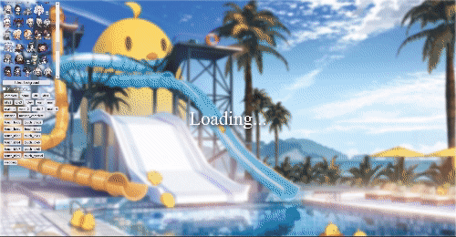

  

# AzurLane-Live2D-Viewer
- 最新的(v.827)版本的碧藍航線Live2D模型
- 操作簡便
- 自動記錄上次查看模型

## 網頁操作說明
- 滾輪縮放
- 滑鼠中鍵重新定位模型
- 左鍵可拖曳模型

## 拆包
我用的是Asset Studio的民間版本：[AssetStudioMod](https://github.com/aelurum/AssetStudio)

而且聽說UnityLive2DExtractor拆不出來，AssetStudio也不會再更新  
所以跳槽了  
這個版本拆出來的品質好太多

## 心得
HitArea如何實現困擾我很久，爬文也沒有東西  

原本想參考這位大佬:  
https://l2d.algwiki.moe/  
https://gitgud.io/alg-wiki/azurlanel2dviewer  
直接轉換vertices座標，結果發現技術含量過高，我玩不起  

之後去pixi-live2d導出的model中找找，在`model.internalModel.coreModel._drawableIds`中找到TouchSpecial、TouchBody、TouchHead這三個Id  
突發奇想丟到hitarea看看，成了  

再來就是把想法擴展到更多的HitAreas，另外我也放了更多背景圖片  
版本是日版(目前最新)，拆包拆出來一定有瑕疵，手變兩條腳變三條之類的，請不要噴我  

可以使用根目錄下的`add_hitareas.py`來自動加入HitAreas

## TODO
1. 加個關於頁面

## 有bug歡迎提出
